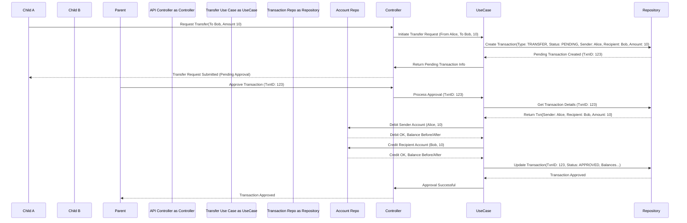

Okay, here are the contents of the two documents in Markdown format.

---

## Family Bank - MVP Definition (v3)

### 1. Introduction

This document defines the scope and use cases for the Minimum Viable Product (MVP) of the Family Bank system. The goal of the MVP is to provide the core functionality for a single family to manage a simple, gamified financial system where children can earn, spend, and transfer a virtual currency between siblings, overseen by a parent. This initial version will be API-first (headless).

### 2. User Roles

* **Parent (Banker):** The administrator of the family's instance. Responsible for setting up the system, defining rules (Products), managing users, approving/modifying transactions (including transfers), and overseeing balances.
* **Child (Accountholder):** A participant in the system who can earn currency, spend currency, and initiate transfers to siblings. In the MVP, their actions are initiated via API calls, likely made *by the Parent* on their behalf initially.

### 3. MVP Use Cases

| ID     | Use Case Name                    | Actor(s)        | Description                                                                                                                                                            | Outcome                                                                                                                             |
| :----- | :------------------------------- | :-------------- | :--------------------------------------------------------------------------------------------------------------------------------------------------------------------- | :---------------------------------------------------------------------------------------------------------------------------------- |
| UC1    | Register Family & Parent         | Parent          | Creates the initial Family Bank instance and the first Parent user account.                                                                                            | Family record created, Parent user record created and authenticated.                                                              |
| UC2    | Add Child Account                | Parent          | Creates a new Child user account linked to the Parent's family.                                                                                                        | Child user record created with an associated Account having a starting balance (likely zero).                                       |
| UC3    | Define Product                   | Parent          | Creates a new item that can be earned (Task) or purchased (Privilege). Specifies name, description, type (Earn/Spend), and amount (value/cost).                           | Product record created and available for transactions.                                                                            |
| UC4    | Edit Product                     | Parent          | Modifies the details (name, description, amount) of an existing Product.                                                                                                 | Product record updated. (Note: Does not affect past transactions).                                                                  |
| UC5    | Delete Product                   | Parent          | Marks a Product as inactive (soft delete) so it can no longer be used for new transactions.                                                                              | Product record marked inactive.                                                                                                   |
| UC6    | List Products                    | Parent          | Views all active Products (both Earn and Spend types) defined for the family.                                                                                            | List of active Products returned.                                                                                                 |
| UC7    | Request Earning (Log Task)       | Child (via API) | Logs the completion of an "Earn" type Product (Task), creating a request for currency.                                                                                   | A *Pending* "Earn" Transaction record is created, associated with the Child's account. Child's balance is *not yet* affected.         |
| UC8    | Request Spending (Use Privilege) | Child (via API) | Logs the request to use/purchase a "Spend" type Product (Privilege), creating a request to deduct currency.                                                              | A *Pending* "Spend" Transaction record is created, associated with the Child's account. Child's balance is *not yet* affected.        |
| **UC9**| **Request P2P Transfer** | **Child (via API)** | **Initiates a request to transfer currency from their account to another Child's account within the same family.** | **A *Pending* "Transfer" Transaction record is created, linked to sender & recipient. Balances are *not yet* affected.** |
| UC10   | View Pending Transactions        | Parent          | Views all transactions currently in the *Pending* state for their family (Earn, Spend, Transfer).                                                                        | List of Pending Transactions returned.                                                                                            |
| UC11   | Approve Transaction              | Parent          | Approves a *Pending* transaction (Earn, Spend, or Transfer).                                                                                                             | Transaction status updated to *Approved*. Relevant Child account balance(s) updated accordingly. Audit details logged.              |
| UC12   | Reject Transaction               | Parent          | Rejects a *Pending* transaction (Earn, Spend, or Transfer).                                                                                                              | Transaction status updated to *Rejected*. Child account balances remain unchanged.                                                |
| UC13   | View Child Details & Balance     | Parent          | Views the profile information and current account balance of a specific child in their family.                                                                           | Child user details and current balance returned.                                                                                  |
| UC14   | Manually Adjust Balance          | Parent          | Directly increases or decreases a Child's balance for reasons outside standard transactions (e.g., initial setup, correction).                                            | An *Approved* "Adjustment" Transaction record is created. Child's account balance updated immediately.                              |
| UC15   | View Transaction History         | Parent, Child   | Views the history of non-pending transactions for a specific child. **Must support filtering by a date range (start date, end date)** and transaction type (optional). | List of relevant Transaction records returned based on filters.                                                                   |
| UC16   | Cancel Approved Transaction      | Parent          | Cancels/reverses a previously *Approved* transaction. Creates a corresponding reversal transaction to adjust balance(s).                                               | Original Transaction marked *Cancelled*. A new *Approved* "Reversal" Transaction is created, adjusting the relevant balance(s) back. |
| UC17   | Modify Pending Transaction       | Parent          | Modifies details (e.g., description, amount) of a transaction that is still in the *Pending* state.                                                                    | Pending Transaction record updated.                                                                                               |
| UC18   | Authenticate Parent              | Parent          | Logs into the system using credentials.                                                                                                                                | Authentication token (e.g., JWT) returned for use in subsequent API calls.                                                        |

*(Note: Sequence diagram simplified for clarity)*

### 4. Explicitly Excluded from MVP

* Dynamic pricing, inflation simulation.
* Inter-family currency transfers/exchanges.
* Automated system-wide events (e.g., Tax Day, scheduled fees).
* Penalties as a distinct feature (can use manual adjustment).
* Appeals mechanism for children.
* Multi-family support and currency exchange rates.
* Advanced reporting, analytics, dashboards, gamification (leaderboards, achievements).
* Dedicated frontend UI (Web or Mobile App).
* Direct Child login and interaction.
* Automated proof of task completion (photos, QR codes).
* Push or email notifications.
* **P2P Transfers *without* Parent approval.**
* Complex transaction filtering beyond date range and type (e.g., by specific product, free-text search).
* Transaction Replay / Retrospective Recalculation (Deferred due to high complexity).
* Advanced product features (fees, taxes - can be bundled into cost/reward for MVP).
* Inventory management for rewards.

---