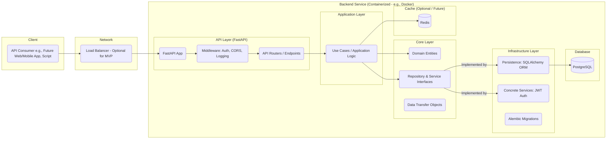

## Family Bank - Backend Architecture & Design (MVP)

### 1. Introduction

This document outlines the backend architecture, data model, and technology stack for the Family Bank MVP. It follows the Clean Architecture principles and focuses on building a robust, maintainable, and testable API-first service.

### 2. Core Domain Entities

These represent the fundamental concepts within the Family Bank domain for the MVP.

* **`Family`**: Represents a single family unit using the system.
    * `id`: UUID (Primary Key)
    * `name`: String (e.g., "Smith Family")
    * `currency_name`: String (e.g., "Points", "Stars", "Family $") - Default: "Points"
    * `created_at`: TimestampTZ
* **`User`**: Represents an individual within a family.
    * `id`: UUID (Primary Key)
    * `family_id`: UUID (Foreign Key to `Family`)
    * `name`: String (e.g., "Alice", "Dad")
    * `role`: Enum (`PARENT`, `CHILD`)
    * `email`: String (Unique, Indexed, for Parent login) - Nullable for Child
    * `hashed_password`: String - Nullable for Child
    * `created_at`: TimestampTZ
* **`Account`**: Represents the financial account holding the balance for a Child.
    * `id`: UUID (Primary Key)
    * `user_id`: UUID (Foreign Key to `User`, Unique - One account per Child user)
    * `family_id`: UUID (Foreign Key to `Family`, Indexed)
    * `balance`: Decimal (High precision, e.g., NUMERIC(12, 2))
    * `updated_at`: TimestampTZ
* **`Product`**: Represents a defined way to earn or spend currency.
    * `id`: UUID (Primary Key)
    * `family_id`: UUID (Foreign Key to `Family`, Indexed)
    * `name`: String (e.g., "Clean Room", "1 Hour Screen Time")
    * `description`: Text (Optional)
    * `type`: Enum (`EARN`, `SPEND`)
    * `amount`: Decimal (High precision, positive value represents reward for EARN, cost for SPEND)
    * `is_active`: Boolean (For soft delete) - Default: True
    * `created_at`: TimestampTZ
    * `updated_at`: TimestampTZ
* **`Transaction`**: Records every change to an Account balance. Designed for immutability once Approved/Rejected/Cancelled.
    * `id`: UUID (Primary Key)
    * `account_id`: UUID (Foreign Key to `Account`, Indexed)
    * `user_id`: UUID (Foreign Key to `User` - Child user associated with the account)
    * `family_id`: UUID (Foreign Key to `Family`, Indexed)
    * `product_id`: UUID (Foreign Key to `Product`, Nullable for manual adjustments/reversals)
    * `type`: Enum (`EARN`, `SPEND`, `ADJUSTMENT`, `REVERSAL`) - Indexed
    * `status`: Enum (`PENDING`, `APPROVED`, `REJECTED`, `CANCELLED`) - Indexed
    * `amount`: Decimal (The amount of the transaction; matches Product amount or adjustment value)
    * `balance_before`: Decimal (Account balance *before* this transaction was approved) - For auditing
    * `balance_after`: Decimal (Account balance *after* this transaction was approved) - For auditing
    * `description`: Text (e.g., Product name, Parent's reason for adjustment/reversal/modification)
    * `created_at`: TimestampTZ (When the request/log was initiated) - Indexed
    * `processed_at`: TimestampTZ (When status changed from PENDING) - Nullable
    * `processed_by_user_id`: UUID (Foreign Key to `User` - Parent who approved/rejected/cancelled) - Nullable

### 3. API Endpoints (MVP)

These endpoints provide the interface to the backend service. Authentication (Bearer Token) is required for all endpoints except `/auth/token` and potentially `POST /families`. Parent role is required for most management actions.

| Method | Path                                       | Description                                                    | Key Request Body / Query Params                      | Key Response Body               |
| :----- | :----------------------------------------- | :------------------------------------------------------------- | :--------------------------------------------------- | :------------------------------ |
| POST   | `/auth/token`                              | Parent Login (Get JWT)                                         | `username` (email), `password`                       | `access_token`, `token_type`    |
| POST   | `/families`                                | Register new Family and first Parent                           | `familyName`, `currencyName`, `parentName`, `email`, `password` | `FamilyReadDTO`, `UserReadDTO`  |
| POST   | `/families/me/children`                    | Parent adds a Child                                            | `name`                                               | `UserReadDTO`, `AccountReadDTO` |
| GET    | `/families/me/children`                    | Parent lists all Children in their family                      | -                                                    | List[`UserReadDTO`]             |
| GET    | `/children/{child_id}`                     | Parent gets details for a specific Child (incl. balance)       | -                                                    | `UserReadDTO`, `AccountReadDTO` |
| POST   | `/children/{child_id}/adjust-balance`      | Parent manually adjusts Child balance                          | `amount` (positive/negative), `description`          | `TransactionReadDTO`            |
| POST   | `/families/me/products`                    | Parent defines a new Product (Earn/Spend)                      | `ProductCreateDTO`                                   | `ProductReadDTO`                |
| GET    | `/families/me/products`                    | Parent lists active Products                                   | `?type=EARN` or `?type=SPEND` (optional filter)      | List[`ProductReadDTO`]          |
| GET    | `/products/{product_id}`                   | Parent gets details of a specific Product                      | -                                                    | `ProductReadDTO`                |
| PUT    | `/products/{product_id}`                   | Parent updates a Product                                       | `ProductUpdateDTO`                                   | `ProductReadDTO`                |
| DELETE | `/products/{product_id}`                   | Parent deletes (soft) a Product                                | -                                                    | Status 204 No Content           |
| POST   | `/transactions/request-earn`               | Log completion of an "Earn" Product                            | `childUserId`, `productId`, `description` (optional)   | `TransactionReadDTO` (Pending)  |
| POST   | `/transactions/request-spend`              | Log request for a "Spend" Product                              | `childUserId`, `productId`, `description` (optional)   | `TransactionReadDTO` (Pending)  |
| GET    | `/families/me/transactions/pending`        | Parent lists all Pending transactions                          | -                                                    | List[`TransactionReadDTO`]      |
| POST   | `/transactions/{transaction_id}/approve`   | Parent approves a Pending transaction                          | `description` (optional override)                    | `TransactionReadDTO` (Approved) |
| POST   | `/transactions/{transaction_id}/reject`    | Parent rejects a Pending transaction                           | `description` (reason for rejection)                 | `TransactionReadDTO` (Rejected) |
| POST   | `/transactions/{transaction_id}/cancel`    | Parent cancels an Approved transaction (creates reversal)      | `description` (reason for cancellation)              | `TransactionReadDTO` (Reversal) |
| GET    | `/children/{child_id}/transactions`        | Get transaction history for a Child                            | `?startDate=...&endDate=...&type=...` (optional filters) | List[`TransactionReadDTO`]      |
| GET    | `/transactions/{transaction_id}`           | Get details of a specific Transaction                          | -                                                    | `TransactionReadDTO`            |
| PUT    | `/transactions/{transaction_id}`           | Parent modifies a *Pending* transaction                        | `description`, `amount` (only if needed)             | `TransactionReadDTO` (Pending)  |

*(Note: DTO definitions implied, e.g., `ProductCreateDTO` would contain `name`, `type`, `amount`, etc.)*

### 4. System Architecture

A standard layered web service architecture:



* **Client:** Any HTTP client interacting with the API.
* **API Layer (FastAPI):** Handles incoming HTTP requests, authentication, request validation (via Pydantic DTOs), serialization, and calls Application Layer use cases.
* **Application Layer:** Orchestrates the business logic. Uses repository interfaces to interact with data and domain entities to represent core concepts. Does not depend on specific frameworks or infrastructure details.
* **Core Layer:** Defines the business rules, entities (plain data structures), and contracts (interfaces/ABCs) for data persistence and external services. Has minimal dependencies.
* **Infrastructure Layer:** Contains concrete implementations of the interfaces defined in Core. Includes database interaction (SQLAlchemy), external service integrations (JWT library), etc. Depends on Core.
* **Database (PostgreSQL):** The persistent storage for all application data.

### 5. Data Model (Conceptual PostgreSQL)

```sql
-- Enum Types (Example - actual implementation might vary)
CREATE TYPE user_role AS ENUM ('PARENT', 'CHILD');
CREATE TYPE product_type AS ENUM ('EARN', 'SPEND');
CREATE TYPE transaction_type AS ENUM ('EARN', 'SPEND', 'ADJUSTMENT', 'REVERSAL');
CREATE TYPE transaction_status AS ENUM ('PENDING', 'APPROVED', 'REJECTED', 'CANCELLED');

-- Tables
CREATE TABLE families (
    id UUID PRIMARY KEY DEFAULT gen_random_uuid(),
    name VARCHAR(255) NOT NULL,
    currency_name VARCHAR(50) NOT NULL DEFAULT 'Points',
    created_at TIMESTAMPTZ NOT NULL DEFAULT NOW()
);

CREATE TABLE users (
    id UUID PRIMARY KEY DEFAULT gen_random_uuid(),
    family_id UUID NOT NULL REFERENCES families(id) ON DELETE CASCADE,
    name VARCHAR(255) NOT NULL,
    role user_role NOT NULL,
    email VARCHAR(255) UNIQUE, -- Nullable for CHILD
    hashed_password VARCHAR(255), -- Nullable for CHILD
    created_at TIMESTAMPTZ NOT NULL DEFAULT NOW(),
    CONSTRAINT chk_parent_email CHECK (role != 'PARENT' OR email IS NOT NULL),
    CONSTRAINT chk_parent_password CHECK (role != 'PARENT' OR hashed_password IS NOT NULL)
);
CREATE INDEX idx_users_family_id ON users(family_id);

CREATE TABLE accounts (
    id UUID PRIMARY KEY DEFAULT gen_random_uuid(),
    user_id UUID NOT NULL REFERENCES users(id) ON DELETE CASCADE UNIQUE, -- Ensure one account per user
    family_id UUID NOT NULL REFERENCES families(id) ON DELETE CASCADE,
    balance NUMERIC(12, 2) NOT NULL DEFAULT 0.00,
    updated_at TIMESTAMPTZ NOT NULL DEFAULT NOW(),
    CONSTRAINT chk_account_balance CHECK (balance >= 0), -- Optional: Prevent negative balances at DB level? Or handle in logic.
    CONSTRAINT fk_account_user_is_child CHECK ( (SELECT role FROM users WHERE id = user_id) = 'CHILD' ) -- Ensure account belongs to a child
);
CREATE INDEX idx_accounts_family_id ON accounts(family_id);

CREATE TABLE products (
    id UUID PRIMARY KEY DEFAULT gen_random_uuid(),
    family_id UUID NOT NULL REFERENCES families(id) ON DELETE CASCADE,
    name VARCHAR(255) NOT NULL,
    description TEXT,
    type product_type NOT NULL,
    amount NUMERIC(10, 2) NOT NULL, -- Always positive; interpretation depends on 'type'
    is_active BOOLEAN NOT NULL DEFAULT TRUE,
    created_at TIMESTAMPTZ NOT NULL DEFAULT NOW(),
    updated_at TIMESTAMPTZ NOT NULL DEFAULT NOW(),
     CONSTRAINT chk_product_amount_positive CHECK (amount > 0) -- Ensure amount is positive
);
CREATE INDEX idx_products_family_id ON products(family_id);
CREATE INDEX idx_products_is_active ON products(is_active);

CREATE TABLE transactions (
    id UUID PRIMARY KEY DEFAULT gen_random_uuid(),
    account_id UUID NOT NULL REFERENCES accounts(id) ON DELETE CASCADE,
    user_id UUID NOT NULL REFERENCES users(id), -- Child user associated with the account
    family_id UUID NOT NULL REFERENCES families(id) ON DELETE CASCADE,
    product_id UUID REFERENCES products(id) ON DELETE SET NULL, -- Allow product deletion without losing history
    type transaction_type NOT NULL,
    status transaction_status NOT NULL,
    amount NUMERIC(10, 2) NOT NULL, -- Amount of this specific transaction
    balance_before NUMERIC(12, 2) NOT NULL, -- Balance before txn was approved
    balance_after NUMERIC(12, 2) NOT NULL, -- Balance after txn was approved
    description TEXT,
    created_at TIMESTAMPTZ NOT NULL DEFAULT NOW(),
    processed_at TIMESTAMPTZ,
    processed_by_user_id UUID REFERENCES users(id), -- Parent who processed
    CONSTRAINT fk_processed_by_is_parent CHECK ( processed_by_user_id IS NULL OR (SELECT role FROM users WHERE id = processed_by_user_id) = 'PARENT' )
);
CREATE INDEX idx_transactions_account_id ON transactions(account_id);
CREATE INDEX idx_transactions_family_id ON transactions(family_id);
CREATE INDEX idx_transactions_status ON transactions(status);
CREATE INDEX idx_transactions_type ON transactions(type);
CREATE INDEX idx_transactions_created_at ON transactions(created_at);
CREATE INDEX idx_transactions_product_id ON transactions(product_id);

-- Trigger for updated_at timestamps (Example)
-- CREATE OR REPLACE FUNCTION trigger_set_timestamp() ...

-- CREATE TRIGGER set_timestamp BEFORE UPDATE ON accounts FOR EACH ROW EXECUTE PROCEDURE trigger_set_timestamp();
-- CREATE TRIGGER set_timestamp BEFORE UPDATE ON products FOR EACH ROW EXECUTE PROCEDURE trigger_set_timestamp();
```

*(Note: `gen_random_uuid()` requires `pgcrypto` extension or use built-in `uuid_generate_v4()`)*
*(Note: Balance updates and `balance_before`/`balance_after` population should be handled carefully within application logic/database transactions to ensure accuracy)*

### 6. Clean Architecture & Code Structure (Python/FastAPI)

We will adhere to the previously defined Clean Architecture structure:

```
/family-bank-api
├── src/
│   ├── core/                 # Interfaces, Domain Entities, DTOs
│   │   ├── domain/           # family.py, user.py, account.py, product.py, transaction.py, common_enums.py
│   │   ├── repositories/     # Abstractions: family_repo.py, user_repo.py, account_repo.py, etc. (ABC)
│   │   ├── use_cases/        # DTOs: family_dtos.py, user_dtos.py, product_dtos.py, etc. (Pydantic)
│   │   └── services/         # Abstractions: auth_service.py (ABC)
│   │
│   ├── infrastructure/       # Concrete Implementations
│   │   ├── persistence/
│   │   │   └── sqlalchemy/   # models.py (SQLAlchemy Tables), repos/ (Implementations), db.py (Session management)
│   │   │   └── alembic/      # Database migration scripts
│   │   └── services/
│   │       └── jwt/          # auth_service.py (JWT Implementation)
│   │
│   ├── application/          # Use Case Implementation / Business Logic
│   │   └── use_cases/        # family_uc.py, user_uc.py, product_uc.py, transaction_uc.py
│   │
│   ├── api/                  # FastAPI Web Layer
│   │   ├── main.py           # FastAPI App instance, DI wiring, middleware setup
│   │   ├── routes/           # auth_routes.py, family_routes.py, user_routes.py, etc.
│   │   ├── middleware/       # auth_middleware.py
│   │   └── dependencies.py   # Common dependencies (get_db, get_current_user)
│   │
│   └── config.py             # Settings management (Pydantic BaseSettings)
│
├── tests/                    # Unit, Integration, E2E Tests
│   ├── core/
│   ├── infrastructure/
│   ├── application/
│   └── api/
├── .env                      # Environment variables
├── .gitignore
├── pyproject.toml            # Project metadata and dependencies (Poetry/PDM)
└── README.md
```

* **Dependency Rule:** `API` -> `Application` -> `Core` <- `Infrastructure`. `Core` has minimal dependencies. `Infrastructure` implements `Core` interfaces. `Application` uses `Core` interfaces. `API` calls `Application` use cases.

### 7. Technology Stack (MVP)

* **Language:** Python 3.11+
* **Web Framework:** FastAPI
* **Data Validation:** Pydantic v2
* **Database:** PostgreSQL 15+
* **ORM:** SQLAlchemy 2.0+ (Core & ORM)
* **Migrations:** Alembic
* **Authentication:** JWT (`python-jose`, `passlib[bcrypt]`)
* **Async Driver (DB):** `asyncpg` (for FastAPI/SQLAlchemy async)
* **Caching:** Redis (Optional - Deferred beyond MVP)
* **Containerization:** Docker, Docker Compose
* **Dependency Management:** Poetry
* **Testing:** `pytest`, `pytest-asyncio`, `httpx`, `factory-boy`, `pytest-cov`

---
