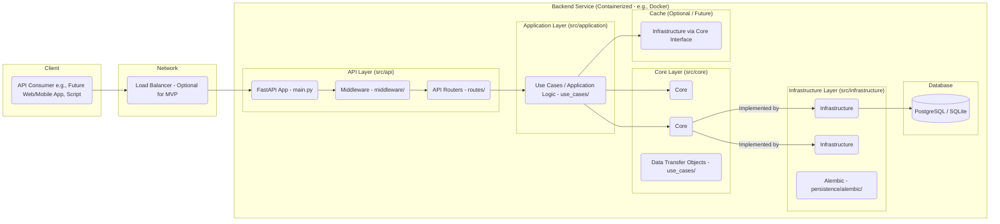

Okay, I've updated the "Backend Architecture & Design" document to strictly follow the Clean Architecture directory structure and principles you provided.

Here is the updated document in Markdown format:

---

## Family Bank - Backend Architecture & Design (MVP v4)

### 1. Introduction

This document outlines the backend architecture, data model, and technology stack for the Family Bank MVP (v4). It strictly follows the Clean Architecture principles and the specific project structure provided, focusing on building a robust, maintainable, and testable API-first service incorporating P2P transfers with approval. The core idea is the strict separation of contracts/interfaces (Core) from concrete implementations (Infrastructure).

### 2. Core Domain Entities

Defined within `src/core/domain/`. These are plain data structures representing the fundamental concepts.

* **`Family`** (`family.py`): Represents a single family unit.
    * `id`, `name`, `currency_name`, `created_at`
* **`User`** (`user.py`): Represents an individual within a family.
    * `id`, `family_id`, `name`, `role` (PARENT/CHILD), `email`, `hashed_password`, `created_at`
* **`Account`** (`account.py`): Represents the financial account for a Child.
    * `id`, `user_id` (CHILD), `family_id`, `balance`, `updated_at`
* **`Product`** (`product.py`): Represents a defined way to earn or spend currency.
    * `id`, `family_id`, `name`, `description`, `type` (EARN/SPEND), `amount`, `is_active`, `created_at`, `updated_at`
* **`Transaction`** (`transaction.py`): Records requests and outcomes of balance changes.
    * `id`: UUID (PK)
    * `account_id`: UUID (FK to Account - *Primary* account involved)
    * `related_account_id`: UUID (FK to Account - *Secondary* account involved, e.g., recipient for TRANSFER) - Nullable
    * `user_id`: UUID (FK to User - Child user associated with `account_id`)
    * `family_id`: UUID (FK to Family)
    * `product_id`: UUID (FK to Product) - Nullable
    * `type`: Enum (`EARN`, `SPEND`, `ADJUSTMENT`, `REVERSAL`, `TRANSFER`)
    * `status`: Enum (`PENDING`, `APPROVED`, `REJECTED`, `CANCELLED`)
    * `amount`: Decimal
    * `balance_before`: Decimal
    * `balance_after`: Decimal
    * `related_balance_before`: Decimal (Nullable)
    * `related_balance_after`: Decimal (Nullable)
    * `description`: Text
    * `created_at`: TimestampTZ (Request time)
    * `processed_at`: TimestampTZ (Nullable)
    * `processed_by_user_id`: UUID (FK to User - Parent who processed) - Nullable
* **Common Enums** (`common_enums.py`): Defines `UserRole`, `ProductType`, `TransactionType`, `TransactionStatus`.

### 3. API Endpoints (MVP v4)

Defined within `src/api/routes/`. Authentication required (except auth/family creation). Parent role required for management.

| Method | Path                                         | Description                                                              | Controller File (Suggestion) |
| :----- | :------------------------------------------- | :----------------------------------------------------------------------- | :--------------------------- |
| POST   | `/auth/token`                                | Parent Login                                                             | `auth_routes.py`             |
| POST   | `/families`                                  | Register Family & Parent                                                 | `family_routes.py`           |
| POST   | `/families/me/children`                      | Add Child                                                                | `user_routes.py`             |
| GET    | `/families/me/children`                      | List Children                                                            | `user_routes.py`             |
| GET    | `/children/{child_id}`                       | Get Child Details & Balance                                              | `user_routes.py`             |
| POST   | `/children/{child_id}/adjust-balance`        | Manually Adjust Balance                                                  | `transaction_routes.py`      |
| POST   | `/families/me/products`                      | Define Product                                                           | `product_routes.py`          |
| GET    | `/families/me/products`                      | List Products                                                            | `product_routes.py`          |
| GET    | `/products/{product_id}`                     | Get Product Details                                                      | `product_routes.py`          |
| PUT    | `/products/{product_id}`                     | Update Product                                                           | `product_routes.py`          |
| DELETE | `/products/{product_id}`                     | Delete (soft) Product                                                    | `product_routes.py`          |
| POST   | `/transactions/request-earn`                 | Log Task Completion                                                      | `transaction_routes.py`      |
| POST   | `/transactions/request-spend`                | Request Privilege Use                                                    | `transaction_routes.py`      |
| POST   | `/transactions/request-transfer`             | Request P2P Transfer                                                     | `transaction_routes.py`      |
| GET    | `/families/me/transactions/pending`          | List Pending Transactions                                                | `transaction_routes.py`      |
| POST   | `/transactions/{transaction_id}/approve`     | Approve Pending Txn (Earn/Spend/Transfer)                                | `transaction_routes.py`      |
| POST   | `/transactions/{transaction_id}/reject`      | Reject Pending Txn                                                       | `transaction_routes.py`      |
| POST   | `/transactions/{transaction_id}/cancel`      | Cancel Approved Txn (Creates Reversal)                                   | `transaction_routes.py`      |
| GET    | `/children/{child_id}/transactions`          | Get Child Transaction History (`?startDate=...&endDate=...&type=...`)    | `transaction_routes.py`      |
| GET    | `/transactions/{transaction_id}`             | Get Specific Transaction Details                                         | `transaction_routes.py`      |
| PUT    | `/transactions/{transaction_id}`             | Modify *Pending* Transaction                                             | `transaction_routes.py`      |

### 4. System Architecture

A standard layered web service architecture following Clean Architecture principles:



* **Dependency Rule:** Inner layers (`Core`) do not depend on outer layers (`Application`, `Infrastructure`, `API`). Outer layers depend inwards. `Application` depends on `Core`. `Infrastructure` depends on `Core`. `API` depends on `Application` and `Core` (for DTOs).

**(Design Note on Transaction Table):** For the MVP, we utilize a single `transactions` table to manage transaction requests, their approval status, and the resulting ledger impact (via `balance_before`/`balance_after` fields populated upon approval). This simplifies implementation and querying for common history views within the defined architecture. A more normalized approach (separating transaction logs, immutable ledger entries, and approval workflow into distinct tables) was considered but deferred. This separation could be a future refactoring step if required by scale or evolving requirements, but the current design provides sufficient auditability and functionality for the MVP scope.

### 5. Data Model (Conceptual PostgreSQL v3)

The conceptual SQL schema remains the same as in v3, defining the necessary tables (`families`, `users`, `accounts`, `products`, `transactions`) and their relationships, intended to be implemented via SQLAlchemy models within the Infrastructure layer.

```sql
-- Enum Types (Example - actual implementation might vary)
CREATE TYPE user_role AS ENUM ('PARENT', 'CHILD');
CREATE TYPE product_type AS ENUM ('EARN', 'SPEND');
CREATE TYPE transaction_type AS ENUM ('EARN', 'SPEND', 'ADJUSTMENT', 'REVERSAL', 'TRANSFER');
CREATE TYPE transaction_status AS ENUM ('PENDING', 'APPROVED', 'REJECTED', 'CANCELLED');

-- Tables
CREATE TABLE families (
    id UUID PRIMARY KEY DEFAULT gen_random_uuid(),
    name VARCHAR(255) NOT NULL,
    currency_name VARCHAR(50) NOT NULL DEFAULT 'Points',
    created_at TIMESTAMPTZ NOT NULL DEFAULT NOW()
);

CREATE TABLE users (
    id UUID PRIMARY KEY DEFAULT gen_random_uuid(),
    family_id UUID NOT NULL REFERENCES families(id) ON DELETE CASCADE,
    name VARCHAR(255) NOT NULL,
    role user_role NOT NULL,
    email VARCHAR(255) UNIQUE, -- Nullable for CHILD
    hashed_password VARCHAR(255), -- Nullable for CHILD
    created_at TIMESTAMPTZ NOT NULL DEFAULT NOW(),
    CONSTRAINT chk_parent_email CHECK (role != 'PARENT' OR email IS NOT NULL),
    CONSTRAINT chk_parent_password CHECK (role != 'PARENT' OR hashed_password IS NOT NULL)
);
CREATE INDEX idx_users_family_id ON users(family_id);

CREATE TABLE accounts (
    id UUID PRIMARY KEY DEFAULT gen_random_uuid(),
    user_id UUID NOT NULL REFERENCES users(id) ON DELETE CASCADE UNIQUE, -- Ensure one account per user
    family_id UUID NOT NULL REFERENCES families(id) ON DELETE CASCADE,
    balance NUMERIC(12, 2) NOT NULL DEFAULT 0.00,
    updated_at TIMESTAMPTZ NOT NULL DEFAULT NOW(),
    CONSTRAINT chk_account_balance CHECK (balance >= 0),
    CONSTRAINT fk_account_user_is_child CHECK ( (SELECT role FROM users WHERE id = user_id) = 'CHILD' )
);
CREATE INDEX idx_accounts_family_id ON accounts(family_id);

CREATE TABLE products (
    id UUID PRIMARY KEY DEFAULT gen_random_uuid(),
    family_id UUID NOT NULL REFERENCES families(id) ON DELETE CASCADE,
    name VARCHAR(255) NOT NULL,
    description TEXT,
    type product_type NOT NULL,
    amount NUMERIC(10, 2) NOT NULL,
    is_active BOOLEAN NOT NULL DEFAULT TRUE,
    created_at TIMESTAMPTZ NOT NULL DEFAULT NOW(),
    updated_at TIMESTAMPTZ NOT NULL DEFAULT NOW(),
     CONSTRAINT chk_product_amount_positive CHECK (amount > 0)
);
CREATE INDEX idx_products_family_id ON products(family_id);
CREATE INDEX idx_products_is_active ON products(is_active);

-- Updated Transactions Table
CREATE TABLE transactions (
    id UUID PRIMARY KEY DEFAULT gen_random_uuid(),
    account_id UUID NOT NULL REFERENCES accounts(id) ON DELETE CASCADE, -- Primary account (sender for TRANSFER)
    related_account_id UUID REFERENCES accounts(id) ON DELETE SET NULL, -- Secondary account (recipient for TRANSFER)
    user_id UUID NOT NULL REFERENCES users(id), -- User associated with account_id
    family_id UUID NOT NULL REFERENCES families(id) ON DELETE CASCADE,
    product_id UUID REFERENCES products(id) ON DELETE SET NULL,
    type transaction_type NOT NULL,
    status transaction_status NOT NULL,
    amount NUMERIC(10, 2) NOT NULL,
    balance_before NUMERIC(12, 2), -- Nullable until approved
    balance_after NUMERIC(12, 2), -- Nullable until approved
    related_balance_before NUMERIC(12, 2), -- Nullable until approved (for TRANSFER)
    related_balance_after NUMERIC(12, 2), -- Nullable until approved (for TRANSFER)
    description TEXT,
    created_at TIMESTAMPTZ NOT NULL DEFAULT NOW(),
    processed_at TIMESTAMPTZ,
    processed_by_user_id UUID REFERENCES users(id), -- Parent who processed
    CONSTRAINT fk_processed_by_is_parent CHECK ( processed_by_user_id IS NULL OR (SELECT role FROM users WHERE id = processed_by_user_id) = 'PARENT' ),
    CONSTRAINT chk_related_account_for_transfer CHECK ( (type = 'TRANSFER' AND related_account_id IS NOT NULL) OR (type != 'TRANSFER' AND related_account_id IS NULL) )
);
-- Indexes
CREATE INDEX idx_transactions_account_id ON transactions(account_id);
CREATE INDEX idx_transactions_related_account_id ON transactions(related_account_id);
CREATE INDEX idx_transactions_family_id ON transactions(family_id);
CREATE INDEX idx_transactions_status ON transactions(status);
CREATE INDEX idx_transactions_type ON transactions(type);
CREATE INDEX idx_transactions_created_at ON transactions(created_at);
CREATE INDEX idx_transactions_product_id ON transactions(product_id);
```

### 6. Clean Architecture & Code Structure (Python/FastAPI)

This project will strictly adhere to the following Clean Architecture structure, separating interfaces from implementations:

```
/family-bank-api
├── src/                      # Main source directory
│   │
│   ├── core/                 # === Contracts & Core Domain ===
│   │   ├── __init__.py
│   │   ├── domain/           # Domain Models/Entities (Plain Classes/Dataclasses)
│   │   │   ├── __init__.py
│   │   │   ├── common_enums.py # UserRole, ProductType, TransactionType, TransactionStatus
│   │   │   ├── family.py
│   │   │   ├── user.py
│   │   │   ├── account.py
│   │   │   ├── product.py
│   │   │   └── transaction.py
│   │   ├── repositories/     # Abstract Repository Interfaces (using abc.ABC)
│   │   │   ├── __init__.py
│   │   │   ├── base_repo.py  # Optional: Base interface with common methods (get_by_id, save)
│   │   │   ├── family_repo.py
│   │   │   ├── user_repo.py
│   │   │   ├── account_repo.py
│   │   │   ├── product_repo.py
│   │   │   └── transaction_repo.py
│   │   ├── use_cases/        # Use Case DTOs (Pydantic Models)
│   │   │   ├── __init__.py
│   │   │   ├── family_dtos.py
│   │   │   ├── user_dtos.py
│   │   │   ├── account_dtos.py
│   │   │   ├── product_dtos.py
│   │   │   └── transaction_dtos.py
│   │   └── services/         # Abstract External Service Interfaces (using abc.ABC)
│   │       ├── __init__.py
│   │       └── auth_service.py # Defines abstract class AuthService(ABC)
│   │       # Add cache_service.py, notification_service.py here if needed later
│   │
│   ├── infrastructure/       # === Concrete Implementations ===
│   │   ├── __init__.py
│   │   ├── persistence/      # Data Persistence Implementations
│   │   │   ├── __init__.py
│   │   │   ├── sqlalchemy/   # SQLAlchemy Implementation
│   │   │   │   ├── __init__.py
│   │   │   │   ├── models.py    # SQLAlchemy declarative models (maps to domain entities)
│   │   │   │   ├── repos/       # Directory for concrete repo implementations
│   │   │   │   │   ├── __init__.py
│   │   │   │   │   ├── family_repo.py # Implements core.repositories.FamilyRepository
│   │   │   │   │   ├── user_repo.py
│   │   │   │   │   ├── account_repo.py
│   │   │   │   │   ├── product_repo.py
│   │   │   │   │   └── transaction_repo.py
│   │   │   │   └── db.py        # Session management, engine setup
│   │   │   └── alembic/      # Database migration scripts (using Alembic)
│   │   │       ├── versions/
│   │   │       ├── env.py
│   │   │       └── script.py.mako
│   │   └── services/         # External Service Implementations
│   │       ├── __init__.py
│   │       └── jwt/          # JWT Implementation
│   │           ├── __init__.py
│   │           └── auth_service.py # Implements core.services.AuthService
│   │       # Add redis/ cache_service.py etc. here if needed
│   │
│   ├── application/          # === Application Logic (Use Case Implementations) ===
│   │   ├── __init__.py
│   │   └── use_cases/
│   │       ├── __init__.py
│   │       ├── family_uc.py    # Implements Family Use Cases
│   │       ├── user_uc.py      # Implements User Use Cases
│   │       ├── account_uc.py   # Implements Account Use Cases (e.g., balance checks)
│   │       ├── product_uc.py   # Implements Product Use Cases
│   │       └── transaction_uc.py # Implements Transaction Use Cases (Request, Approve, Reject, etc.)
│   │
│   ├── api/                  # === Web Layer & Wiring ===
│   │   ├── __init__.py
│   │   ├── main.py           # FastAPI app instance, DI wiring, middleware setup, startup/shutdown events
│   │   ├── routes/           # API Route definitions using APIRouter
│   │   │   ├── __init__.py
│   │   │   ├── auth_routes.py
│   │   │   ├── family_routes.py
│   │   │   ├── user_routes.py
│   │   │   ├── product_routes.py
│   │   │   └── transaction_routes.py
│   │   ├── middleware/       # API Middleware implementations
│   │   │   ├── __init__.py
│   │   │   └── auth_middleware.py # Authentication middleware using AuthService interface
│   │   └── dependencies.py   # FastAPI dependencies (e.g., get_db_session, get_current_user)
│   │
│   └── config.py             # Configuration loading (Pydantic BaseSettings)
│
├── tests/                    # Tests directory mirroring src structure
│   ├── __init__.py
│   ├── core/
│   ├── infrastructure/
│   ├── application/
│   └── api/
├── .env                      # Environment variables file (loaded by config.py)
├── .gitignore
├── pyproject.toml            # Project definition, dependencies (Poetry)
└── README.md
```

### 7. Technology Stack (MVP)

* **Language:** Python 3.11+
* **Web Framework:** FastAPI
* **Data Validation:** Pydantic v2
* **Database:** PostgreSQL 15+ (Recommended). SQLAlchemy allows for using SQLite for initial development/testing if preferred, but PostgreSQL is the target for production.
* **ORM:** SQLAlchemy 2.0+ (Core & ORM)
* **Migrations:** Alembic
* **Authentication:** JWT (`python-jose`, `passlib[bcrypt]`)
* **Async Driver (DB):** `asyncpg` (for FastAPI/SQLAlchemy async with PostgreSQL)
* **Caching:** Redis (Optional - Deferred beyond MVP, requires defining `CacheService` in Core and implementing in Infrastructure)
* **Containerization:** Docker, Docker Compose
* **Dependency Management:** Poetry
* **Testing:** `pytest`, `pytest-asyncio`, `httpx`, `factory-boy`, `pytest-cov`

---